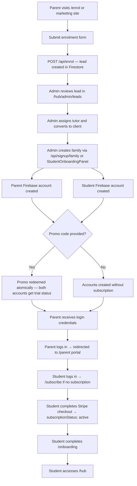
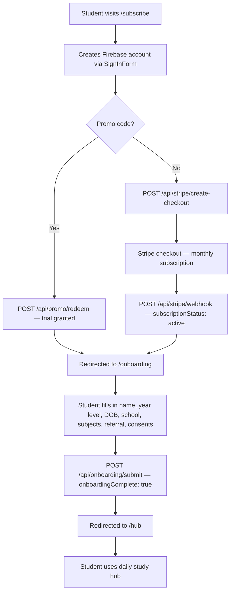
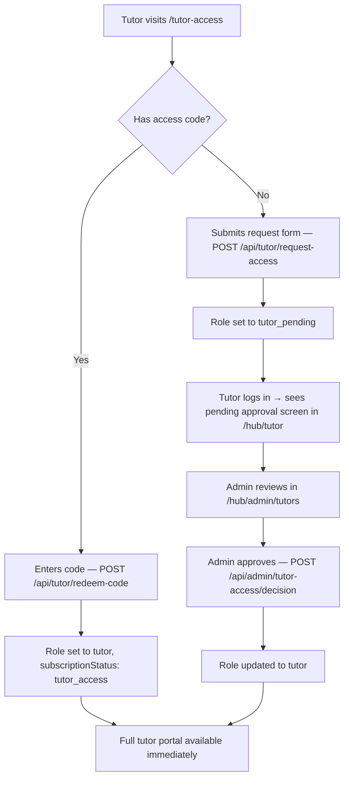
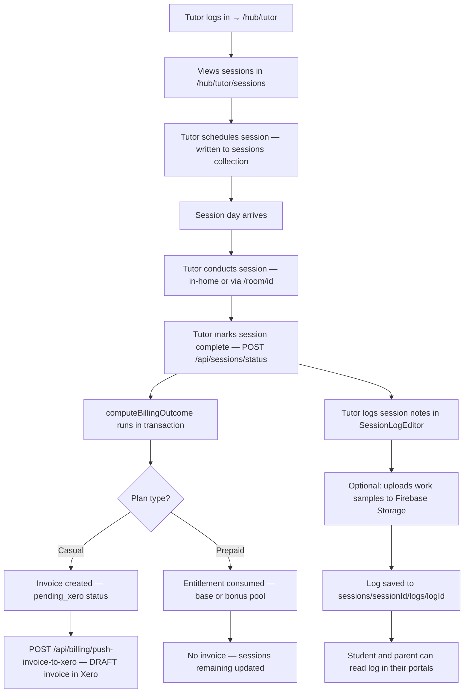
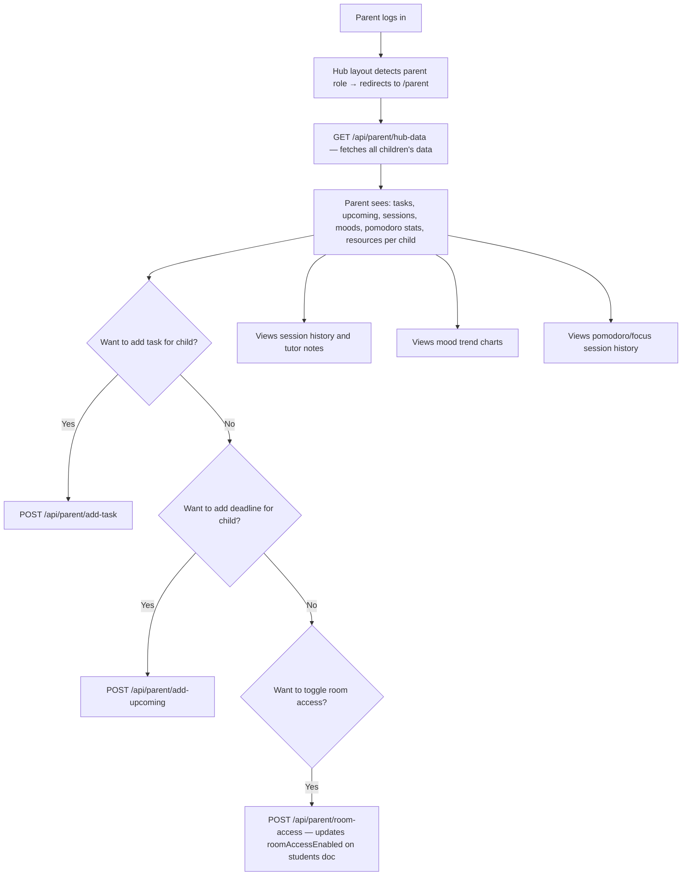
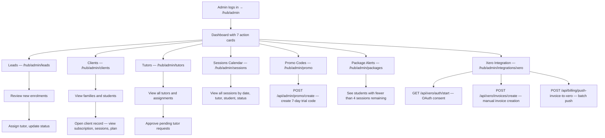
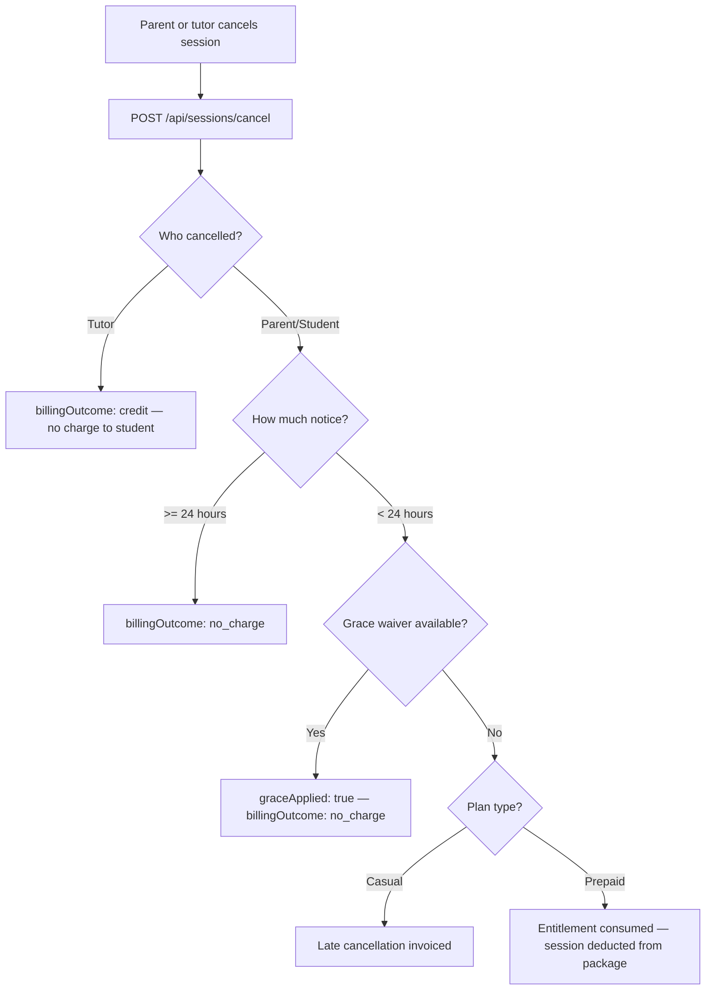
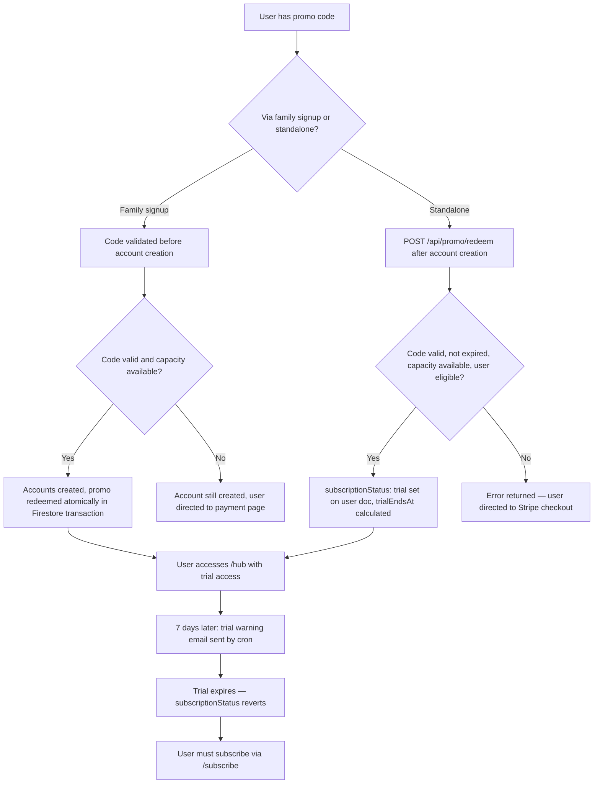

# 03 — User Journeys

## Overview

This document maps the complete lifecycle journeys for each user type, from initial discovery through normal daily usage. All journeys reflect the current implementation.

---

## Journey 1 — New Family Signup (Beta Path)



**Key API calls:**
- `POST /api/signup/family` — atomic account creation
- `POST /api/stripe/create-checkout` — subscription payment
- `POST /api/stripe/webhook` — sets `subscriptionStatus: "active"`
- `POST /api/onboarding/submit` — sets `onboardingComplete: true`

---

## Journey 2 — Independent Student Signup



---

## Journey 3 — Student Daily Usage

```mermaid
flowchart TD
    A[Student logs in] --> B[Auth state check — subscriptionStatus + onboardingComplete]
    B --> C[/hub dashboard loads]
    C --> D{Getting started checklist complete?}
    D -- No --> E[Prompted to: add deadline, add task, log mood, try focus session]
    D -- Yes --> F[Full dashboard shown]
    F --> G[Streak display — fires AlexBuddy greeting]
    G --> H[Student manages tasks in TaskListWidget]
    G --> I[Student adds/checks deadline in DailyPlannerWidget]
    G --> J[Student logs mood in MoodTrackerWidget]
    G --> K[Student starts Pomodoro in PomoWidget]
    K --> L[After 25min block — short break, then repeat]
    G --> M[Student opens /lobby — study room selection]
    M --> N[Student joins /room/id — LiveKit video session]
    N --> O[Uses chat, whiteboard, focus timer in room]
    O --> P[Returns to hub]
```

**After 6pm:** AlexBuddy delivers evening mood nudge if no mood has been logged that day.

---

## Journey 4 — Tutor Onboarding



---

## Journey 5 — Tutor Session Workflow



---

## Journey 6 — Parent Portal Usage



---

## Journey 7 — Admin Operations



---

## Journey 8 — Session Cancellation / Late Cancellation



---

## Journey 9 — Promo Code Redemption


