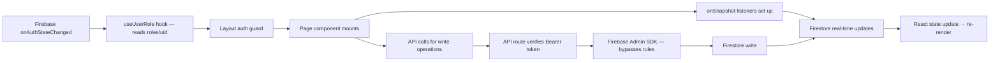
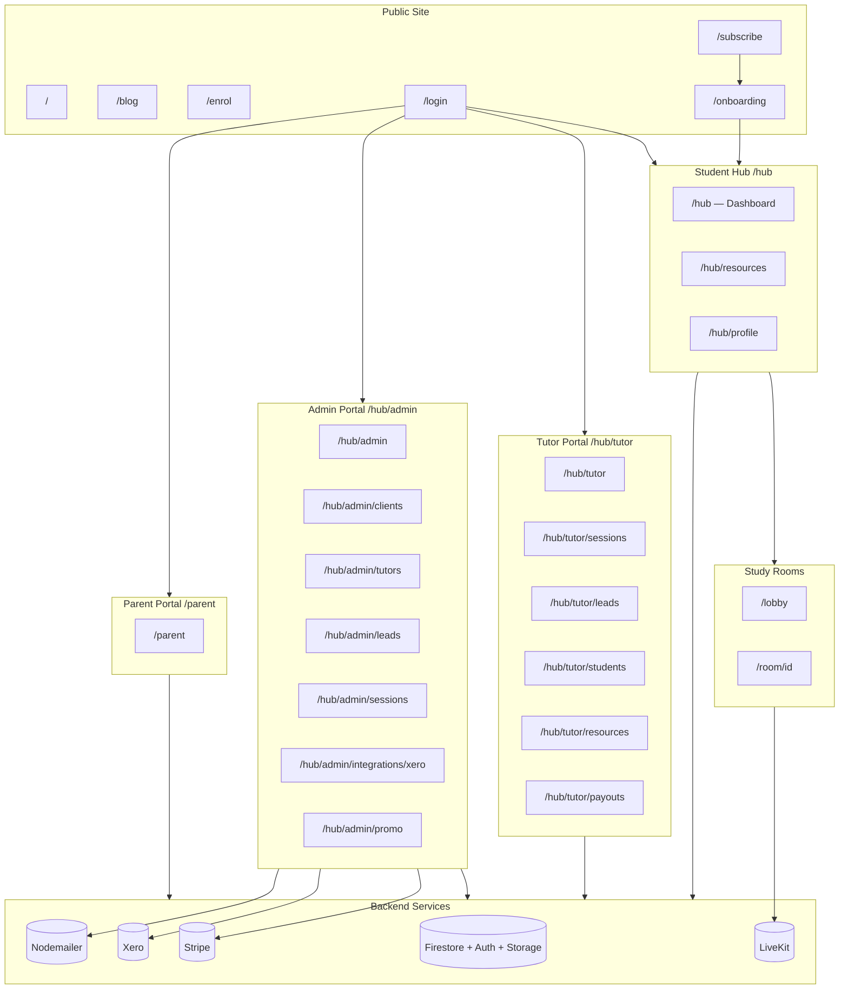

# 04 — App Architecture

## Framework & Stack

| Layer | Technology |
|-------|-----------|
| Framework | Next.js 16 (App Router) |
| UI | React 19 + TypeScript |
| Database | Firebase Firestore |
| Auth | Firebase Authentication (email/password) |
| Storage | Firebase Cloud Storage |
| Video | LiveKit |
| Payments | Stripe |
| Accounting | Xero |
| Email | Nodemailer (Gmail SMTP) |
| Calendar UI | FullCalendar |
| Date utilities | date-fns |
| Markdown | marked, remark |

---

## Directory Structure

```
src/
├── app/                    # Next.js App Router pages and API routes
│   ├── layout.tsx          # Root layout — SiteShell wrapper, metadata
│   ├── page.tsx            # Public homepage (marketing)
│   ├── api/                # All API route handlers
│   ├── hub/                # Student hub + tutor/admin sub-portals
│   │   ├── layout.tsx      # Hub auth gate (subscription + onboarding checks)
│   │   ├── page.tsx        # Student dashboard
│   │   ├── resources/      # Student resource library
│   │   ├── profile/        # Student account settings
│   │   ├── tutor/          # Tutor portal (role-gated)
│   │   └── admin/          # Admin portal (email-gated)
│   ├── parent/             # Parent portal (role-gated, separate from /hub)
│   ├── lobby/              # Study room lobby
│   ├── room/[id]/          # LiveKit video rooms
│   ├── login/              # Sign in
│   ├── enrol/              # Public enrolment form
│   ├── subscribe/          # Stripe subscription flow
│   ├── onboarding/         # Post-signup onboarding form
│   ├── tutor-access/       # Tutor self-registration
│   ├── blog/               # Public blog (listing + detail)
│   ├── headstart/          # HeadStart workshops marketing
│   ├── worksheets/         # Worksheets marketing
│   ├── resources/          # Public resources
│   ├── contact/            # Contact form
│   ├── about/              # About page
│   ├── tutoring/           # Tutoring services page
│   └── legal/              # Terms, privacy, safety
├── components/             # Shared React components
│   ├── hub/                # Portal navigation components
│   ├── session/            # Session management components
│   ├── students/           # Student management components (tutor-facing)
│   ├── widgets/            # Dashboard widget components
│   ├── ui/                 # Primitive UI components (Toast, Drawer)
│   └── [misc]              # AlexBuddy, Navbar, Footer, SiteShell, etc.
├── hooks/                  # Custom React hooks
├── lib/                    # Utilities and configuration
│   ├── firebase.ts         # Firebase client SDK initialisation
│   ├── firebaseAdmin.ts    # Firebase Admin SDK (server-side only)
│   ├── storage.ts          # Firebase Storage upload helpers
│   ├── posts.ts            # Blog post helpers
│   ├── xero.ts             # Xero client and token management
│   └── studyroom/          # Core business logic
│       ├── billing.ts      # Billing constants and outcome computation
│       ├── serverBilling.ts# Atomic session action transactions
│       ├── invoiceEngine.ts# Family invoice generation
│       └── siblingPricing.ts # Sibling session pricing logic
└── types/                  # (unclear — types appear to be defined inline in components)
```

---

## Route Architecture

### Public Routes (no auth required)

```
/                     Homepage (marketing)
/about                About page
/tutoring             Services detail
/contact              Contact form
/enrol                Enrolment form
/blog                 Blog post listing
/blog/[slug]          Blog post detail
/headstart            HeadStart workshops
/worksheets           Custom worksheets
/resources            Public resources
/login                Sign in
/tutor-access         Tutor self-registration
/legal/terms          Terms of service
/legal/privacy        Privacy policy
/legal/safety         Safety policy
```

### Subscription Flow Routes

```
/subscribe            Stripe checkout or promo code redemption
/onboarding           Post-payment onboarding form
```

### Student Hub (requires auth + active subscription + onboarding)

```
/hub                  Student dashboard
/hub/resources        Full resource library
/hub/profile          Account settings
/lobby                Study room selection
/room/[id]            LiveKit video room (room-1 to room-4)
```

### Tutor Portal (requires tutor or admin role)

```
/hub/tutor                      Tutor home
/hub/tutor/sessions             Session management
/hub/tutor/leads                Leads marketplace
/hub/tutor/leads/[leadsId]      Lead detail
/hub/tutor/students             Student list
/hub/tutor/students/[id]        Student profile
/hub/tutor/payouts              Payout export
/hub/tutor/resources            Resource management
/hub/tutor/calendar             Calendar view
```

### Admin Portal (requires admin email)

```
/hub/admin                              Admin home
/hub/admin/leads                        Leads list
/hub/admin/leads/[leadId]               Lead detail
/hub/admin/leads/new                    New lead form
/hub/admin/clients                      Client list
/hub/admin/clients/[clientId]           Client/family profile
/hub/admin/tutors                       Tutor list
/hub/admin/tutors/[tutorId]             Tutor profile
/hub/admin/students/add-existing        Add existing student
/hub/admin/students/[studentId]         Student record
/hub/admin/sessions                     All sessions
/hub/admin/calendar                     Sessions calendar
/hub/admin/blog                         Blog CMS
/hub/admin/promo                        Promo code management
/hub/admin/packages                     Package alerts
/hub/admin/payments                     Payment records
/hub/admin/invoices                     Invoice management
/hub/admin/integrations/xero            Xero OAuth and sync
```

### Parent Portal (requires parent role)

```
/parent               Parent portal (single page, all children's data)
```

---

## Authentication Guards

There is **no `middleware.ts` file**. Auth guards are implemented as client-side checks inside layout components.

### Hub Layout (`src/app/hub/layout.tsx`)
```
1. Check Firebase auth state via onAuthStateChanged
2. If not authenticated → redirect to /
3. If role === "admin" (email gate) → allow through
4. If role === "tutor" or "tutor_pending" → allow through (no subscription needed)
5. If role === "parent" → redirect to /parent
6. If role === "student":
   a. subscriptionStatus must be "active" or "trial"
   b. onboardingComplete must be true
   c. Trial: trialEndsAt must not be expired
   d. Fail any check → redirect to /subscribe
7. Wrap children in AlexBuddy component
```

### Admin Layout (`src/app/hub/admin/layout.tsx`)
```
1. Verify role === "admin"
2. Non-admin → redirect to /hub
3. Admin: render sticky nav with admin-specific navigation items
```

### Tutor Layout (`src/app/hub/tutor/layout.tsx`)
```
1. Verify role === "tutor" | "admin" | "tutor_pending"
2. If tutor_pending → show approval-pending form (not full portal)
3. Otherwise → full tutor portal
```

### Parent Page (`src/app/parent/page.tsx`)
```
1. Check Firebase auth state
2. Verify role === "parent"
3. Non-parent → redirect
4. Parent: fetch hub data via /api/parent/hub-data
```

---

## Data Flow Pattern



**State Management:** There is no global state library (no Redux, Zustand, Context API for data). Each page and component sets up its own Firestore `onSnapshot` listeners. Cross-component communication uses:
- `window.alexBuddy.say(key)` — for triggering the Alex Buddy companion from any component
- Direct Firestore updates — other components listening to the same collection pick up changes automatically

---

## SiteShell — Public vs. Portal Navigation

`src/components/SiteShell.tsx` wraps the root layout and renders the public `Navbar` and `Footer`. It is **hidden** on the following route prefixes:
- `/room`
- `/hub`
- `/lobby`
- `/parent`
- `/legal`

Portal pages use their own navigation: `PortalHeader.tsx` (hub), `HubTopBar.tsx`, or custom nav in the admin/parent layouts.

---

## AlexBuddy Integration

`AlexBuddy.tsx` is rendered by the hub layout and the lobby layout. It wraps children as a React component and injects a `window.alexBuddy.say(key)` function. Any component anywhere in the hub or lobby can trigger an Alex Buddy message by calling this global function.

Message keys include: `login`, `task_complete`, `focus_start`, `focus_end`, `idle`, `mood_save`, `deadline_soon`, `streak_milestone`, `room_enter`, `evening_nudge`.

The component also sets up its own idle detection (20-second timer) and an evening mood nudge (triggers after 6pm if no mood has been logged today, via a Firestore read of `users/{uid}/moodLogs`).

---

## Mermaid Architecture Diagram


