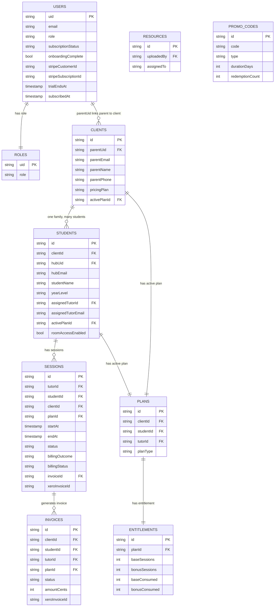

# 05 — Firestore Data Model

## Overview

All application data is stored in Firebase Firestore (`studyroom-6ba75` project). This document describes every known collection, its document structure, relationships, and access patterns.

**Important:** Invoice, plan, and entitlement writes are performed exclusively via the **Firebase Admin SDK** (server-side). The Firestore security rules explicitly deny client-side writes on these collections.

---

## Entity Relationship Overview



---

## Collection: `users/{uid}`

**Purpose:** Stores the authenticated user's profile and subscription state. The `uid` is the Firebase Auth UID.

**Who reads:** Self, tutors (assigned students), admin  
**Who writes:** Self (profile fields), server-side (subscription fields via Admin SDK)

### Document Schema

| Field | Type | Description |
|-------|------|-------------|
| `displayName` | string | User's display name |
| `email` | string | Firebase Auth email |
| `role` | string | Role copy (primary role source is `roles/{uid}`) |
| `subscriptionStatus` | string | `"active"` \| `"trial"` \| `"cancelled"` \| `"past_due"` \| `"tutor_access"` |
| `onboardingComplete` | boolean | Whether the student has completed onboarding |
| `stripeCustomerId` | string | Stripe Customer ID (set by webhook) |
| `stripeSubscriptionId` | string | Stripe Subscription ID (set by webhook) |
| `trialEndsAt` | Timestamp | When the trial expires |
| `trialStartedAt` | Timestamp | When the trial began |
| `trialWarningEmailSent` | boolean | Whether the trial warning email has been sent |
| `promoCode` | string | The promo code used to start the trial |
| `subscribedAt` | Timestamp | When the paid subscription began |
| `createdAt` | Timestamp | Account creation time |
| `updatedAt` | Timestamp | Last update |

### Subcollections

#### `users/{uid}/tasks/{taskId}`
Daily task items for the student.

| Field | Type | Description |
|-------|------|-------------|
| `title` | string | Task description |
| `done` | boolean | Completion state |
| `source` | string | Optional: links to an `upcoming` item ID |
| `dueDate` | string | Optional: `YYYY-MM-DD` |
| `createdAt` | Timestamp | — |

**Read:** Self, tutors, admin  
**Write:** Self, tutors (create only), admin

#### `users/{uid}/upcoming/{itemId}`
Assessment and deadline items.

| Field | Type | Description |
|-------|------|-------------|
| `title` | string | Assessment name |
| `subject` | string | Subject area |
| `type` | string | e.g. "test", "assignment", "exam" |
| `dueDate` | string | `YYYY-MM-DD` |
| `handoutDate` | string | Optional: when handed out |
| `draftDate` | string | Optional: draft due date |
| `completed` | boolean | Whether submitted |
| `createdAt` | Timestamp | — |

**Subcollection:** `users/{uid}/upcoming/{assessmentId}/checkpoints/{checkpointId}` — Student-only read/write.

**Read:** Self, tutors, admin  
**Write:** Self only

#### `users/{uid}/moodLogs/{logId}`
Daily mood log entries.

| Field | Type | Description |
|-------|------|-------------|
| `date` | string | `YYYY-MM-DD` (used as document ID) |
| `mood` | string | `"Stressed"` \| `"Tired"` \| `"OK"` \| `"Good"` \| `"Great"` |
| `note` | string | Optional note |
| `createdAt` | Timestamp | — |

**Read:** Self, tutors, admin  
**Write:** Self only

#### `users/{uid}/pomoHistory/{pomoId}`
Completed Pomodoro focus session records.

| Field | Type | Description |
|-------|------|-------------|
| `date` | string | `YYYY-MM-DD` |
| `durationMs` | number | Duration in milliseconds |
| `completedAt` | Timestamp | — |

**Read/Write:** Self, admin

#### `users/{uid}/pomoState/{docId}` and `users/{uid}/pomoSessions/{pomoId}`
Active Pomodoro timer state. Used for persisting timer state across browser sessions.

**Read/Write:** Self, admin

#### `users/{uid}/streak/{docId}`
Streak calculation state (persisted by `useStreak` hook).

| Field | Type | Description |
|-------|------|-------------|
| `currentStreak` | number | Current consecutive day count |
| `longestStreak` | number | All-time best streak |
| `lastUpdated` | Timestamp | — |

**Read:** Self, tutors, admin  
**Write:** Self, admin

---

## Collection: `roles/{uid}`

**Purpose:** Role assignment. The `uid` is the Firebase Auth UID.

**Who reads:** Self, tutors, admin  
**Who writes:** Self (limited), admin (full)

### Document Schema

| Field | Type | Description |
|-------|------|-------------|
| `role` | string | `"student"` \| `"parent"` \| `"tutor"` \| `"tutor_pending"` \| `"admin"` |
| `updatedAt` | Timestamp | — |
| `grantedViaCode` | string | Optional: code used for tutor activation |

**Client-side role creation rules:**
- Users can only create their own role document
- Self-created roles can only be `"student"`, `"parent"`, or `"tutor_pending"`
- Users cannot change their own role after creation (only admin can)

---

## Collection: `clients/{clientId}`

**Purpose:** Family/parent records. Each family has one client document. This is the **billing and contact anchor** for the family.

**Who reads:** Admin, assigned tutor (by `assignedTutorId/Email`), parent (by email match)  
**Who writes:** Admin only (creates via Admin SDK). Tutors can update `tutorNotes` only.

### Document Schema

| Field | Type | Description |
|-------|------|-------------|
| `parentName` | string | Primary guardian's name |
| `parentEmail` | string | Primary guardian's email — key for permission checks |
| `parentPhone` | string | Contact phone number |
| `parentUid` | string | Firebase Auth UID of the parent account |
| `pricingPlan` | string | `"CASUAL"` \| `"PACKAGE_5"` \| `"PACKAGE_12"` |
| `activePlanId` | string | Reference to `plans/{id}` |
| `assignedTutorId` | string | UID of assigned tutor |
| `assignedTutorEmail` | string | Email of assigned tutor |
| `tutorNotes` | string | Tutor-editable notes field |
| `type` | string | `"family"` |
| `createdAt` | Timestamp | — |
| `updatedAt` | Timestamp | — |

---

## Collection: `students/{studentId}`

**Purpose:** CRM student records. Separate from the Firebase Auth account — linked via `hubUid`.

**Who reads:** Admin, assigned tutor, parent (by email match via `hubEmail`), self (via `hubUid`)  
**Who writes:** Admin only (create/delete). Tutors can update limited fields.

### Document Schema

| Field | Type | Description |
|-------|------|-------------|
| `studentName` | string | Student's full name |
| `yearLevel` | string | e.g. `"Year 10"` |
| `dob` | string | Date of birth |
| `school` | string | School name |
| `subjects` | string[] | Subjects being tutored |
| `clientId` | string | Reference to `clients/{id}` |
| `hubUid` | string | Firebase Auth UID of the student — the link to `users/{uid}` |
| `hubEmail` | string | Firebase Auth email of the student |
| `activePlanId` | string | Reference to `plans/{id}` |
| `assignedTutorId` | string | UID of assigned tutor |
| `assignedTutorEmail` | string | Email of assigned tutor |
| `roomAccessEnabled` | boolean | Whether the student can access study rooms |
| `tutorNotes` | string | Tutor-editable notes |
| `tutorConfirmedAt` | Timestamp | When tutor confirmed the student record |
| `tutorConfirmedBy` | string | UID of tutor who confirmed |
| `createdAt` | Timestamp | — |
| `updatedAt` | Timestamp | — |

### Subcollection: `students/{studentId}/sessions/{noteId}`

Session notes stored at the student level (separate from the top-level `sessions` collection).

**Read/Write:** Admin; tutors assigned to this student.

---

## Collection: `sessions/{sessionId}`

**Purpose:** Top-level tutoring session records. Each document represents one scheduled or completed session. This is the central collection for billing.

**Who reads:** Admin, session tutor, assigned student (via `hubUid`), parent (via `clientId` → `parentEmail`)  
**Who writes:** Tutors create sessions; Admin SDK updates billing fields.

### Document Schema

| Field | Type | Description |
|-------|------|-------------|
| `tutorId` | string | Firebase Auth UID of the tutor |
| `tutorEmail` | string | Tutor's email |
| `studentId` | string | Reference to `students/{id}` |
| `clientId` | string | Reference to `clients/{id}` |
| `planId` | string | Reference to `plans/{id}` |
| `startAt` | Timestamp | Session start time |
| `endAt` | Timestamp | Session end time |
| `durationMinutes` | number | Planned duration (usually 60) |
| `modality` / `mode` | string | `"in_home"` \| `"online"` \| `"group"` |
| `status` | string | `"scheduled"` \| `"completed"` \| `"cancelled_by_parent"` \| `"cancelled_by_tutor"` \| `"no_show"` |
| `billingOutcome` | string | `"consume_entitlement"` \| `"invoice"` \| `"no_charge"` \| `"credit"` |
| `billingStatus` | string | `"READY_TO_INVOICE"` \| `"PREPAID"` \| `"CREDITED"` \| `"NOT_BILLED"` \| `"DRAFT_CREATED"` \| `"ERROR"` |
| `invoiceId` | string | Reference to `invoices/{id}` |
| `xeroInvoiceId` | string | Xero invoice UUID |
| `xeroInvoiceStatus` | string | `"DRAFT"` \| `"AUTHORISED"` \| `"VOIDED"` |
| `xeroError` | string | Error message if Xero push failed |
| `graceApplied` | boolean | Whether a late-cancel grace waiver was applied |
| `noticeHours` | number | Hours of notice given for cancellation |
| `consumed` | boolean | Whether a prepaid entitlement was consumed |
| `consumedFrom` | string | `"base"` \| `"bonus"` |
| `notes` | string | Tutor session notes (brief) |
| `seriesKey` | string | Links recurring sessions in a series |
| `unitPlanWeek` | string | Optional link to curriculum unit plan |
| `worksheetId` | string | Optional link to worksheet |
| `cancelledAt` | Timestamp | — |
| `completedAt` | Timestamp | — |
| `createdAt` | Timestamp | — |
| `updatedAt` | Timestamp | — |

### Subcollection: `sessions/{sessionId}/logs/{logId}`

Detailed session notes and work sample uploads written by the tutor after each session.

| Field | Type | Description |
|-------|------|-------------|
| `notes` | string | Detailed session notes |
| `workSamples` | array | Array of `{ url, path, fileName, contentType, size }` |
| `createdAt` | Timestamp | — |
| `tutorId` | string | UID of tutor who created the log |

**Read:** Tutor (own), student (own sessions), parent (own children's sessions), admin  
**Write:** Tutor (own sessions), admin

---

## Collection: `invoices/{invoiceId}`

**Purpose:** Billing records for tutoring sessions. All writes are via Admin SDK only.

**Who reads:** Admin, session tutor  
**Who writes:** Admin SDK only (client writes are denied by Firestore rules)

### Document Schema

| Field | Type | Description |
|-------|------|-------------|
| `clientId` | string | Reference to `clients/{id}` |
| `studentId` | string | Reference to `students/{id}` |
| `sessionId` | string | Reference (single session) |
| `sessionIds` | string[] | References (family invoice with multiple sessions) |
| `planId` | string | Reference to `plans/{id}` |
| `tutorId` | string | Tutor UID |
| `tutorEmail` | string | Tutor email |
| `planType` | string | `"casual"` \| `"package_5"` \| `"package_12"` |
| `mode` | string | Session mode |
| `status` | string | Invoice lifecycle status (see Billing doc) |
| `xeroInvoiceId` | string | Xero UUID |
| `xeroInvoiceStatus` | string | Xero-side status |
| `xeroError` | string | Error message |
| `xeroDebug` | object | Full debug info from Xero SDK errors |
| `amountCents` | number | Invoice total in cents |
| `totalCents` | number | Alternative total field (legacy/current) |
| `lineItems` | array | Line item objects (see Billing doc) |
| `dateKey` | string | `YYYY-MM-DD` for family invoice grouping |
| `issuedAt` | Timestamp | — |
| `dueAt` | Timestamp | — |
| `triggeredBy` | string | `"completion"` \| `"eod_fallback"` |
| `rateSummary` | array | Rate breakdown per session |
| `waivedReason` | string | If status is "waived" |
| `waivedAt` | Timestamp | — |
| `createdAt` | Timestamp | — |
| `updatedAt` | Timestamp | — |

---

## Collection: `plans/{planId}`

**Purpose:** Billing plan configuration for a student-tutor relationship.

**Who reads:** Admin, assigned tutor  
**Who writes:** Admin SDK only

### Document Schema (partial — full schema unclear, check `src/lib/studyroom/billing.ts` and `serverBilling.ts`)

| Field | Type | Description |
|-------|------|-------------|
| `clientId` | string | Reference to `clients/{id}` |
| `studentId` | string | Reference to `students/{id}` |
| `tutorId` | string | Tutor UID |
| `tutorEmail` | string | Tutor email |
| `planType` | string | `"casual"` \| `"package_5"` \| `"package_12"` |
| `mode` | string | Default session mode |
| `status` | string | Plan active/inactive |
| `createdAt` | Timestamp | — |

---

## Collection: `entitlements/{entitlementId}`

**Purpose:** Session credit tracking for prepaid packages (package_5, package_12).

**Who reads:** Admin, assigned tutor  
**Who writes:** Admin SDK only (atomic transactions via `applySessionAction()`)

### Document Schema (partial)

| Field | Type | Description |
|-------|------|-------------|
| `planId` | string | Reference to `plans/{id}` |
| `baseSessions` | number | Total base sessions purchased (e.g. 10) |
| `bonusSessions` | number | Bonus sessions included (e.g. 2) |
| `baseConsumed` | number | Base sessions used |
| `bonusConsumed` | number | Bonus sessions used |
| `createdAt` | Timestamp | — |
| `updatedAt` | Timestamp | — |

---

## Collection: `packages/{packageId}`

**Purpose:** Unclear. Appears to track sessions used/remaining at a higher level than `entitlements`. May be a legacy or parallel system. See [15_Known_Technical_Debt.md](15_Known_Technical_Debt.md) for notes.

**Who reads:** Admin, assigned tutor  
**Who writes:** Admin; tutors can update `sessionsUsed`, `sessionsRemaining`, `status`, `updatedAt`

---

## Collection: `leads/{leadId}`

**Purpose:** Enquiries and enrolment submissions from prospective students. Also used for tutor access requests.

**Who reads:** Admin (all); tutors (unclaimed leads or own claimed leads)  
**Who writes:** Admin; tutors can claim unclaimed leads

### Document Schema (partial)

| Field | Type | Description |
|-------|------|-------------|
| `status` | string | `"new"` \| `"claimed"` \| `"converted"` \| `"inactive"` |
| `claimedTutorId` | string | UID of tutor who claimed the lead |
| `claimedAt` | Timestamp | — |
| `parentName` | string | — |
| `parentEmail` | string | — |
| `parentPhone` | string | — |
| `studentName` | string | — |
| `yearLevel` | string | — |
| `subjects` | string[] | — |
| `mode` | string | — |
| `suburb` | string | — |
| `availability` | string | — |
| `goals` | string | — |
| `createdAt` | Timestamp | — |
| `updatedAt` | Timestamp | — |

---

## Collection: `enquiries/{enquiryId}`

**Purpose:** Separate from leads — stores contact form submissions from the public `/contact` page.

**Who reads/writes:** Tutors and admin

---

## Collection: `resources/{resourceId}`

**Purpose:** Tutor-uploaded study materials (worksheets, past papers, guides, flashcards).

**Who reads:** All authenticated users  
**Who writes:** Tutors (own uploads), admin

> **Note:** All authenticated users can read the resources collection in Firestore. Client-side filtering in `hub/page.tsx` is used to show only the resources relevant to each student. This is a conscious architectural trade-off documented in the Firestore rules comments.

### Document Schema

| Field | Type | Description |
|-------|------|-------------|
| `title` | string | Resource name |
| `subject` | string | Subject area |
| `type` | string | `"worksheet"` \| `"past_paper"` \| `"guide"` \| `"flashcard"` |
| `fileUrl` | string | Firebase Storage download URL |
| `fileName` | string | Original file name |
| `fileSize` | number | File size in bytes |
| `uploadedBy` | string | Tutor UID |
| `uploadedByName` | string | Tutor display name |
| `uploadedAt` | Timestamp | — |
| `assignedTo` | string | Student UID or `"all"` |
| `description` | string | Optional description |
| `createdAt` | Timestamp | — |
| `updatedAt` | Timestamp | — |

---

## Collection: `rooms/{roomId}`

**Purpose:** Study room metadata (not video data — LiveKit manages the actual video session).

**Who reads:** All authenticated  
**Who writes:** Creator (limited fields only)

### Document Schema

| Field | Type | Description |
|-------|------|-------------|
| `title` | string | Room name (immutable after creation) |
| `createdBy` | string | UID of creator |
| `createdAt` | Timestamp | Immutable |
| `lastActiveAt` | Timestamp | Last activity |
| `isActive` | boolean | Whether room is currently occupied |
| `participantCount` | number | Current participants |

### Subcollection: `rooms/{roomId}/chat/{msgId}`

Real-time chat messages inside a study room.

| Field | Type | Description |
|-------|------|-------------|
| `uid` | string | Sender UID |
| `email` | string | Sender email (optional) |
| `name` | string | Sender display name |
| `text` | string | Message text (max 2000 chars) |
| `fileUrl` | string | Optional file attachment URL (max 300 chars) |
| `fileName` | string | Optional file name (max 200 chars) |
| `createdAt` | Timestamp | — |

**Read:** All authenticated  
**Delete:** Own messages, or tutors/admin

### Subcollection: `rooms/{roomId}/whiteboard/{strokeId}`

Collaborative whiteboard strokes.

**Read/Write:** All authenticated

---

## Collection: `promoCodes/{codeId}`

**Purpose:** Trial and discount codes. All writes are Admin SDK only (server-side).

**Who reads/writes:** Admin only

### Document Schema

| Field | Type | Description |
|-------|------|-------------|
| `code` | string | The promo code string (uppercase) |
| `active` | boolean | Whether the code can be redeemed |
| `type` | string | `"free_trial"` \| `"full_access"` |
| `durationDays` | number | Trial length in days (default 7) |
| `expiresAt` | Timestamp | Optional: code expiry date |
| `maxRedemptions` | number | Optional: max number of uses |
| `redemptionCount` | number | Current use count |
| `redeemedBy` | string[] | Array of UIDs who have redeemed |
| `eligibility` | string | `"new_users_only"` (default) \| `"any_user"` |
| `createdAt` | Timestamp | — |
| `updatedAt` | Timestamp | — |

---

## Collection: `tutorAccessCodes/{codeId}`

**Purpose:** One-time codes for activating tutor accounts.

**Who reads/writes:** Admin only

### Document Schema

| Field | Type | Description |
|-------|------|-------------|
| `code` | string | The access code |
| `tutorEmail` | string | Email the code is issued for |
| `used` | boolean | Whether the code has been redeemed |
| `expiresAt` | Timestamp | Optional expiry |
| `redeemedAt` | Timestamp | When it was used |
| `redeemedByUid` | string | UID of user who redeemed |
| `redeemedByEmail` | string | Email of user who redeemed |

---

## Collection: `integrations/xero`

**Purpose:** Single document storing the Xero OAuth token and tenant ID. Written by the Xero OAuth callback.

**Who reads/writes:** Admin only

### Document Schema

| Field | Type | Description |
|-------|------|-------------|
| `tenantId` | string | Xero organisation UUID |
| `tokenSet` | object | Full OAuth2 token (access_token, refresh_token, expires_at, etc.) |
| `updatedAt` | Timestamp | — |

> **Security:** This document contains live OAuth refresh tokens. It is admin-read-only at the Firestore rules level and should never be exposed to client-side code.

---

## Collection: `reports/{reportId}`

**Purpose:** User-submitted reports of chat messages in study rooms.

**Who reads:** Tutors, admin  
**Who writes:** Any authenticated user (create only)

### Document Schema

| Field | Type | Description |
|-------|------|-------------|
| `roomId` | string | Room where the message appeared |
| `messageId` | string | ID of the reported message |
| `reportedBy` | string | UID of reporter |
| `messageText` | string | Content of the reported message |
| `messageOwnerId` | string | UID of message author |
| `reason` | string | Reason for report |
| `createdAt` | Timestamp | — |

---

## Collection: `betaFeedback/{docId}`

**Purpose:** Feedback submitted by users via the FeedbackButton component.

**Who reads:** Admin  
**Who writes:** Any authenticated user (create only; cannot update or delete)

### Document Schema

| Field | Type | Description |
|-------|------|-------------|
| `type` | string | Feedback category |
| `message` | string | Feedback text (max 2000 chars) |
| `uid` | string | Submitter UID |
| `email` | string | Submitter email |
| `role` | string | Submitter's role |
| `page` | string | Page where feedback was submitted |
| `createdAt` | Timestamp | — |

---

## Collection: `blogPosts/{slug}`

**Purpose:** Blog post content managed via the admin blog CMS.

**Who reads:** All (if `published == true`); admin (all)  
**Who writes:** Admin only

### Document Schema (partial)

| Field | Type | Description |
|-------|------|-------------|
| `title` | string | Post title |
| `slug` | string | URL slug (also the document ID) |
| `content` | string | Post body (Markdown) |
| `published` | boolean | Publication status |
| `createdAt` | Timestamp | — |
| `updatedAt` | Timestamp | — |

---

## Collection: `studentPlans/{studentId}`

**Purpose:** Unclear. Document ID is the student ID. May be a parallel or legacy plan system. See [15_Known_Technical_Debt.md](15_Known_Technical_Debt.md).

**Who reads/writes:** Tutors and admin

---

## Collection: `tutors/{uid}` — Tutor Profile (V2)

**Status:** Introduced in Tutor Profile V2. No top-level `tutors/{uid}` document existed prior to V2.

**Purpose:** Living professional record for each tutor. Single source of truth for all capability, availability, capacity, and compliance data used for operational matching. Replaces the fragmented fields previously scattered across `users/{uid}.subjects`, `users/{uid}.phone`, `users/{uid}.bio`, and `users/{uid}.tutorAccessRequest.application`.

**Who reads:** Tutor (own document — direct Firestore read); Admin  
**Who writes:** API route `/api/tutors/profile` (tutor-initiated, validated server-side); Admin SDK (admin-initiated)

**Tutors cannot write directly to Firestore.** All tutor-initiated writes go through the validated API route, which enforces the editable field allowlist (`TUTOR_PROFILE_EDITABLE_FIELDS` in `src/lib/studyroom/tutorConstants.ts`) and rejects unknown or protected fields with a `400` error.

**Types:** See `src/types/tutor.ts` — `TutorProfile` and `TutorProfileUpdatePayload`.  
**Constants:** See `src/lib/studyroom/tutorConstants.ts`.

### Key fields

| Field | Type | Owner | Notes |
|-------|------|-------|-------|
| `phone` | string | Tutor | Onboarding, updatable |
| `bio` | string | Tutor | Onboarding, updatable |
| `capabilities` | `TutorCapability[]` | Tutor | Subject + years + readiness. Subject/year combinations validated against controlled vocabulary. |
| `supportCapabilities` | `TutorSupportCapability[]` | Tutor | From `SUPPORT_CAPABILITIES` controlled list. With readiness. |
| `modes` | string[] | Tutor | `"online"` \| `"in_home"` \| `"group"` |
| `suburb / postcode` | string | Tutor | Home base for travel estimation |
| `serviceSuburbs` | string[] | Tutor | Suburbs willing to travel to |
| `availabilityDays` | string[] | Tutor | Day-level availability (V2). Time-slot scheduling deferred. |
| `availabilityNote` | string | Tutor | Human-readable context (e.g. "Mon–Thu after 3:30pm") |
| `desiredHoursPerWeek` | number | Tutor | Target weekly hours |
| `maxHoursPerWeek` | number | Tutor | Hard ceiling per week |
| `abn` | string | Tutor | Submitted; admin verifies in internal/admin |
| `wwccNumber / wwccState / wwccExpiresAt` | string / Timestamp | Tutor | Submitted; admin verifies in internal/admin |
| `blueCardNumber / blueCardExpiresAt` | string / Timestamp | Tutor | Optional; submitted; admin verifies |
| `profileStatus` | string | System/Admin | **Protected.** `"draft"` → `"pending_review"` (API on complete submission) → `"active"` (admin) → `"paused"` (admin) |
| `onboardingCompletedAt` | Timestamp | System | **Protected.** Set by API on first complete submission |
| `createdAt / updatedAt` | Timestamp | System | **Protected.** Set by system only |

### Capability model

`TutorCapability` entries use a subject + years + readiness structure. QLD ACiQ subjects (Mathematics, English, Science, HASS, Health & PE) pair only with Prep–Year 10. QLD QCAA subjects (e.g. Mathematical Methods, Biology) pair only with Year 11–12. Cross-validation is enforced by the API route via `isValidSubjectYearCombination()`.

Tutors only list what they can offer. A missing entry means "not offered" — tutors are never asked to list what they cannot teach.

### Proposed Firestore rule (Phase 2 — NOT YET DEPLOYED)

> ⚠️ The `firestore.rules` file in this repository may not reflect the live deployed rules. Before applying any rule changes, Lily must compare the proposed rules below against the real rules in the Firebase Console.

```
match /tutors/{uid} {
  allow read:  if isSelf(uid) || isAdmin();
  allow write: if isAdmin();   // tutors write via API route only
}
```

---

## Collection: `tutors/{uid}/internal/admin` — Admin-Only Internal Record (V2)

**Purpose:** All admin-only operational data: compliance verification, matching gate (`readyForMatching`), capacity status, quality flags, capability advisories, admin notes, and interview record. Completely opaque to tutors.

**Who reads/writes:** Admin only. Tutors have zero access (read or write).  
**Document path:** `tutors/{tutorUid}/internal/admin` — single fixed document per tutor.

**Types:** See `src/types/tutor.ts` — `TutorInternalAdmin`.

### Key fields

| Field | Type | Notes |
|-------|------|-------|
| `wwccVerified / blueCardVerified` | boolean | Admin sets after checking documents |
| `readyForMatching` | boolean | **Admin-only gate.** Tutor is never auto-promoted. Requires: profileStatus = "active" AND wwccVerified = true AND explicit admin action. |
| `onboardingStage` | string | `"pending"` \| `"active"` \| `"probation"` \| `"paused"` \| `"offboarded"` |
| `approxCurrentHoursPerWeek` | number | Admin-estimated from session schedule. **Stale-data risk.** |
| `capacityStatus` | string | `"has_capacity"` \| `"near_capacity"` \| `"at_capacity"` \| `"paused"` |
| `approxUpdatedAt` | Timestamp | When admin last updated capacity. Flag in UI if older than 14 days. |
| `maxHoursOverride` | number \| null | Overrides tutor's `maxHoursPerWeek` if set |
| `capabilityAdvisories` | `CapabilityAdvisory[]` | Admin annotations on top of tutor capabilities. Does not replace tutor data. |
| `qualityFlag` | boolean | True = something needs admin attention |
| `mentorRequired` | boolean | True = active mentoring needed |
| `recommendedForNewStudents` | boolean | Admin's overall recommendation signal |
| `adminNotes` | string | Single notes field for V2. Convention: prepend `"[YYYY-MM-DD]"` per entry. Replace with subcollection in a future phase if volume warrants. |
| `interviewDate / interviewNotes` | Timestamp / string | Admin records philosophy and approach observations from interview. Philosophy questions belong here, not in the onboarding form. |

### Staleness risk

`approxCurrentHoursPerWeek` and `capacityStatus` have no automatic update mechanism. Without a regular admin process, they drift. The admin matching UI must show `approxUpdatedAt` and flag entries older than `CAPACITY_STALENESS_DAYS` (14 days).

Future Phase 6 will derive `currentAssignedHoursPerWeek` from the `sessions` collection automatically.

### Proposed Firestore rule (Phase 2 — NOT YET DEPLOYED)

> ⚠️ The `firestore.rules` file in this repository may not reflect the live deployed rules.

```
match /tutors/{uid}/internal/{docId} {
  allow read, write: if isAdmin();   // tutor has NO access
}
```

---

## Collection: `tutors/{uid}/studentPlans`, `worksheets`, `sessionNotes` (Existing Subcollections)

These subcollections predate V2 and are not affected by the Tutor Profile introduction.

| Subcollection | Purpose | Who reads/writes |
|--------------|---------|-----------------|
| `studentPlans/{docId}` | Per-student unit plans created by tutor | Self (tutor) + Admin |
| `worksheets/{docId}` | Worksheets created by tutor in student view | Self (tutor) + Admin |
| `sessionNotes/{docId}` | Session notes keyed by room ID | Self (tutor) + Admin |

Current Firestore wildcard rule `match /tutors/{uid}/{document=**}` covers these. This wildcard is **unsafe** for the `internal/admin` subcollection and is targeted for replacement in Phase 2. See [15_Known_Technical_Debt.md](15_Known_Technical_Debt.md).

---

## Notable Design Patterns

### Email-based Access Control
Parent and tutor access to `clients` and `students` documents relies on email matching (`parentEmail == authedEmail()`, `assignedTutorEmail == authedEmail()`). This means if a user's email changes in Firebase Auth, they may lose access to their records.

### hubUid as the Link Between CRM and Auth
The `students/{id}.hubUid` field is the critical link between the CRM student record (where billing, sessions, and tutor assignments live) and the Firebase Auth user (where subscription status and hub access live). Any student profile creation must set this field correctly.

### Admin SDK Bypasses All Rules
The comment in `firestore.rules` above the `invoices` collection makes this explicit: invoices, plans, and entitlements are only written server-side via Admin SDK, which bypasses Firestore security rules entirely. Client-side write rules for these collections are set to `if false` as a belt-and-suspenders measure.
