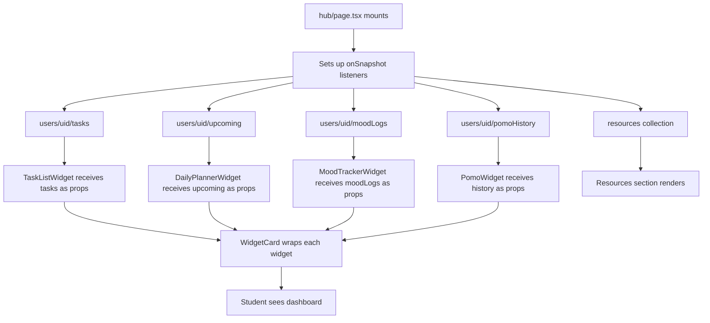

# 08 — Widget System

## Overview

The Studyroom student hub uses a dashboard widget architecture. Widgets are React components that:
- Display a specific type of student data
- Have a collapsed card view and an expanded sheet/full view
- Listen to Firestore subcollections in real time via `onSnapshot`
- Are wrapped in a shared `WidgetCard` component for consistent styling

Widgets live in `src/components/widgets/` and are rendered in `src/app/hub/page.tsx`.

---

## WidgetCard (Shared Wrapper)

**File:** `src/components/widgets/WidgetCard.tsx`

**Purpose:** Provides a consistent outer shell for all dashboard widgets. Renders the widget title and wraps its children. Handles expand/collapse behaviour for the sheet view.

**Props:**
- `title` — Display title for the widget
- `children` — The widget's content

**Used by:** All widgets below

---

## Widget 1 — PomoWidget (Private Pomodoro)

**File:** `src/components/widgets/PomoWidget.tsx`  
**Also related:** `src/components/PomodoroBar.tsx` (standalone bar variant)

**Purpose:** Focus timer using the Pomodoro technique. Tracks session history and displays statistics.

**Firestore collections:**
- `users/{uid}/pomoHistory` — stores completed session records (date, durationMs, completedAt)
- `users/{uid}/pomoState` — persists active timer state across browser sessions

**Session cycle (8-step):**
1. Study block 1 (default 25min)
2. Short break (5min)
3. Study block 2 (25min)
4. Short break (5min)
5. Study block 3 (25min)
6. Short break (5min)
7. Study block 4 (25min)
8. Long break (15min)

**Features:**
- Editable session durations (user can change the default 25min blocks)
- Wall-clock aligned ticking (timer stays accurate even if tab is backgrounded)
- Audio alarm on session end (uses `<audio>` element with Web Audio API fallback)
- Stats shown on hub dashboard: sessions today, sessions this week, sessions this month, current streak, average session length, best time of day
- AlexBuddy integration: calls `window.alexBuddy.say("focus_start")` on start, `"focus_end"` on complete

**Where it appears:**
- Student hub dashboard (`/hub`) — collapsed card view
- Hub dashboard sheet (expanded full view with charts)

---

## Widget 2 — TaskListWidget (Quick Study Plan)

**File:** `src/components/widgets/TaskListWidget.tsx`

**Purpose:** Daily task management. Students add tasks for the day, check them off as complete, and track progress.

**Firestore collections:**
- `users/{uid}/tasks` — task items with `title`, `done`, `source` (links to upcoming item), `dueDate`

**Features:**
- Progress bar showing tasks completed / total tasks
- Collapse/expand completed tasks section
- Assessment task tagging (`source` field links a task to an `upcoming` item)
- Tasks can be added by the student directly, by a tutor, or by a parent (via `/api/parent/add-task`)
- AlexBuddy integration: calls `window.alexBuddy.say("task_complete")` when a task is checked off

**Where it appears:**
- Student hub dashboard — "Quick Study Plan" card

---

## Widget 3 — DailyPlannerWidget (Coming Up Soon)

**File:** `src/components/widgets/DailyPlannerWidget.tsx`

**Purpose:** Assessment and deadline management. Shows upcoming items on a timeline with urgency-based colour coding.

**Firestore collections:**
- `users/{uid}/upcoming` — assessment items with `title`, `subject`, `type`, `dueDate`, `handoutDate`, `draftDate`, `completed`
- `users/{uid}/upcoming/{assessmentId}/checkpoints/{checkpointId}` — checkpoint subtasks for complex assessments

**Features:**
- Date-based urgency coloring (items approaching their due date are highlighted)
- Optional handout date and draft date tracking (for multi-stage assessments)
- Checkpoint subtasks within each upcoming item
- Toggle between timeline view and list view
- Completion tracking per item
- AlexBuddy integration: calls `window.alexBuddy.say("deadline_soon")` when deadlines are within a threshold

**Where it appears:**
- Student hub dashboard — "Coming Up Soon" card

---

## Widget 4 — MoodTrackerWidget

**File:** `src/components/widgets/MoodTrackerWidget.tsx`

**Purpose:** Daily mood check-in. Students log their mood once per day on a 5-point scale, with an optional note.

**Firestore collections:**
- `users/{uid}/moodLogs` — mood entries, keyed by date (`YYYY-MM-DD` as document ID)

**Mood scale:**
| Level | Label |
|-------|-------|
| 1 | Stressed |
| 2 | Tired |
| 3 | OK |
| 4 | Good |
| 5 | Great |

**Features:**
- One mood log per day (today's log is upserted to the same document ID)
- Optional note field alongside the mood selection
- 7-day mood trend graph (bar or line chart)
- Streak integration: mood logs are read by `useStreak` to calculate check-in streaks
- AlexBuddy integration: calls `window.alexBuddy.say("mood_save")` on save

**Where it appears:**
- Student hub dashboard — "Mood Tracker" card
- Parent portal — parent can see child's mood history (read-only)

---

## Widget 5 — StudyroomsWidget

**File:** `src/components/widgets/StudyroomsWidget.tsx`

**Purpose:** Provides quick-access shortcut buttons to the four study rooms.

**Firestore collections:** None directly (study rooms use LiveKit; room metadata is in `rooms/{roomId}`)

**Features:**
- Displays the 4 available study rooms with their "vibe" descriptions:
  - Room 1: Math focus
  - Room 2: English study
  - Room 3: Light Exam revision
  - Room 4: Creative work
- Links to `/room/room-1` through `/room/room-4`
- Room access gate: if student's `roomAccessEnabled` is false, access is blocked

**Where it appears:**
- Student hub dashboard

---

## AlexBuddy (AI Companion)

**File:** `src/components/AlexBuddy.tsx`

**Purpose:** An animated companion character that provides contextual encouragement and nudges throughout the student's session. Not a traditional widget — it wraps the entire hub and lobby layout.

**Communication interface:**
- Global function: `window.alexBuddy.say(key: string)`
- Any component can trigger a message by calling this global function
- The AlexBuddy component injects this function on mount

**Message keys:**
| Key | Trigger |
|-----|---------|
| `login` | User enters the hub |
| `task_complete` | Student checks off a task |
| `focus_start` | Pomodoro session begins |
| `focus_end` | Pomodoro session completes |
| `idle` | No interaction for 20 seconds |
| `mood_save` | Mood logged |
| `deadline_soon` | Upcoming item approaching |
| `streak_milestone` | Streak reaches a milestone |
| `room_enter` | Student enters a study room |
| `evening_nudge` | After 6pm with no mood logged (auto-triggered) |

**Idle detection:** AlexBuddy sets a 20-second timer on mount. If the user has no interaction in 20 seconds, it triggers the `"idle"` message.

**Evening nudge:** On mount and at regular intervals, AlexBuddy checks `users/{uid}/moodLogs` to see if a mood has been logged today. If it's after 6pm and no mood exists, it triggers `"evening_nudge"`.

**Where it appears:**
- Wraps all of `/hub` (via `hub/layout.tsx`)
- Wraps `/lobby` (via `lobby/layout.tsx`)

---

## PomodoroBar

**File:** `src/components/PomodoroBar.tsx`

**Purpose:** A standalone pomodoro bar component (separate from PomoWidget). Likely used in the study room or lobby context.

**Features:** Same 8-step cycle as PomoWidget. Wall-clock aligned. Audio alarm.

**Where it appears:** Unclear from exploration — may appear in the room or lobby layout.

---

## Widget Data Flow

---

## Widget Extension Rules

When adding new widgets:
1. Create a new component in `src/components/widgets/`
2. Wrap it with `WidgetCard` for consistent styling
3. Set up the Firestore `onSnapshot` listener in `hub/page.tsx` (not inside the widget itself, to avoid duplicate listeners)
4. Pass data to the widget as props
5. Integrate with AlexBuddy via `window.alexBuddy.say(key)` where appropriate
6. Document the Firestore collections used in this file
