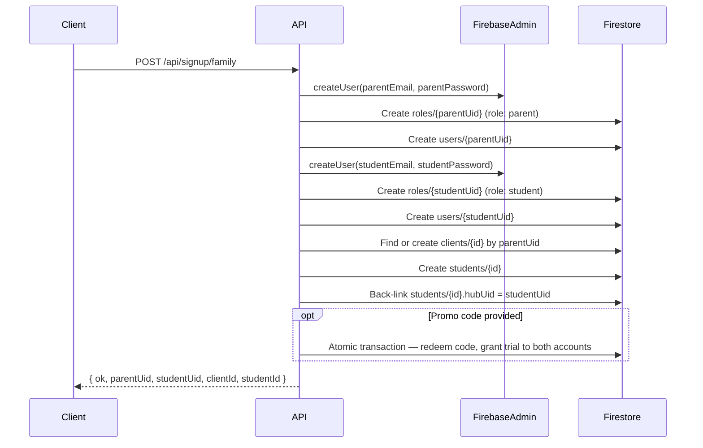
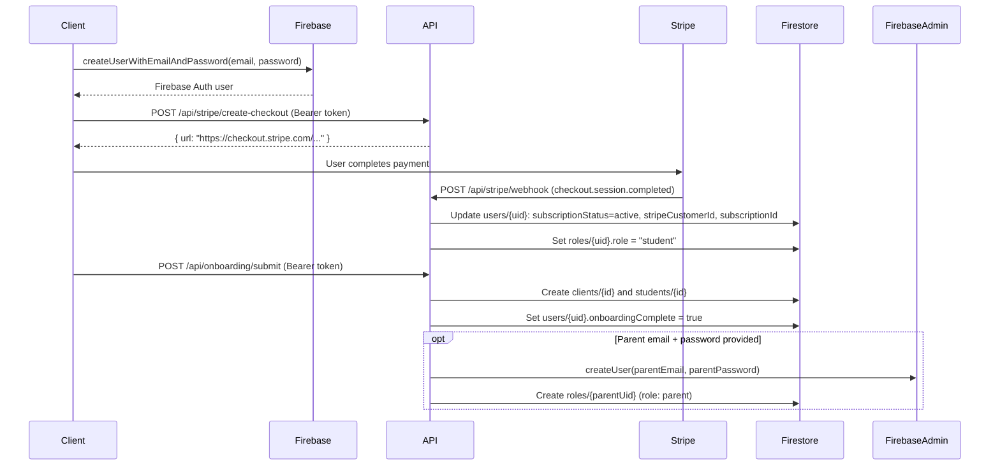
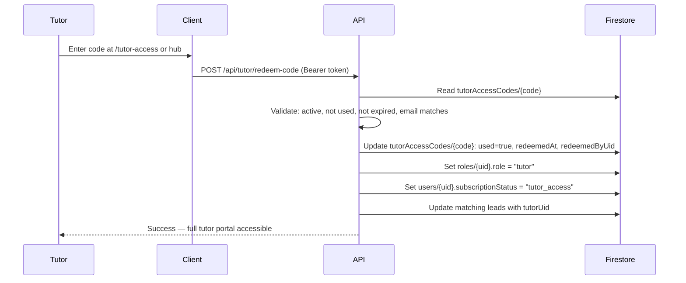
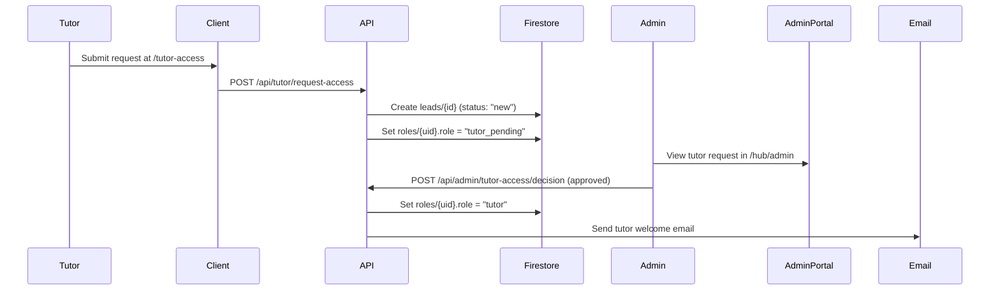

# 09 — Authentication

## Overview

Studyroom uses Firebase Authentication with email/password as the sole authentication method. Role assignment and access control are layered on top of Firebase Auth using a combination of Firestore documents, hard-coded email gates, and server-side token verification.

---

## Firebase Auth Configuration

**Provider:** Email/Password only  
**Project:** `studyroom-6ba75`  
**Auth domain:** `studyroom-6ba75.firebaseapp.com`

**Client SDK** (`src/lib/firebase.ts`):
- Initialised once via `initializeApp()`
- Exports: `auth`, `db`, `storage`
- Used in client components for `onAuthStateChanged`, `signInWithEmailAndPassword`, `createUserWithEmailAndPassword`, `signOut`

**Admin SDK** (`src/lib/firebaseAdmin.ts`):
- Initialised on the server via service account credentials (env vars: `FIREBASE_PROJECT_ID`, `FIREBASE_CLIENT_EMAIL`, `FIREBASE_PRIVATE_KEY`)
- Exports: `getAdminApp()`, `getAdminAuth()`, `getAdminDb()`
- Key helper: `verifyIdTokenFromRequest(request)` — extracts and verifies the `Authorization: Bearer <idToken>` header from incoming API requests

---

## Role System

### Where Roles Are Stored

Roles are stored in two places:

1. **`roles/{uid}` Firestore collection** — authoritative source for tutor, student, parent, tutor_pending
2. **Hard-coded email list** — admin role is granted to specific email addresses regardless of Firestore

### Client-Side Role Hook: `useUserRole`

**File:** `src/hooks/useUserRole.ts`

This hook:
1. Subscribes to `roles/{uid}` via `onSnapshot` for real-time role changes
2. Checks if the authenticated user's email is in the hard-coded admin list
3. Returns the effective role: `"student" | "tutor" | "tutor_pending" | "admin" | "parent" | null`

**Admin emails (hard-coded in the hook):**
- `lily.studyroom@gmail.com`
- `contact.studyroomaustralia@gmail.com`

> **Warning:** The second email (`contact.studyroomaustralia@gmail.com`) appears in `useUserRole.ts` but NOT in `firestore.rules`. This means it appears as admin in the UI but does not have admin Firestore permissions. See [15_Known_Technical_Debt.md](15_Known_Technical_Debt.md).

### Firestore Rules Admin Check

In `firestore.rules`, the admin function is:
```
function isAdmin() {
  return isAuthed() && request.auth.token.email == "lily.studyroom@gmail.com";
}
```
Only `lily.studyroom@gmail.com` is treated as admin in the database rules.

---

## Signup Paths

### Path A — Family Signup (`POST /api/signup/family`)

Creates both a parent and student account in a single server-side operation.



### Path B — Independent Student Signup



---

## Login Flow

1. User visits `/login` and submits email/password via `SignInForm.tsx`
2. Client calls `signInWithEmailAndPassword(auth, email, password)` (Firebase SDK)
3. On success, `onAuthStateChanged` fires in the hub/parent layouts
4. Role is determined via `useUserRole` hook (reads `roles/{uid}`)
5. Redirect based on role:
   - `admin` → `/hub` (bypasses subscription checks)
   - `tutor` or `tutor_pending` → `/hub/tutor`
   - `parent` → `/parent`
   - `student` with `subscriptionStatus: "active" | "trial"` and `onboardingComplete: true` → `/hub`
   - `student` without subscription → `/subscribe`
   - `student` with subscription but no onboarding → `/onboarding`

---

## Tutor Activation

### Path A — Access Code



### Path B — Admin Approval



---

## Parent-Student Linking

The parent → student relationship is established via two mechanisms:

1. **`clients/{id}.parentEmail`** — the parent's email address is stored on the family record
2. **`students/{id}.hubUid`** — the student's Firebase Auth UID stored on the CRM student record

**Firestore rule for parent access:**
```
allow read: if isAuthed()
  && resource.data.parentEmail != null
  && authedEmail() != null
  && resource.data.parentEmail == authedEmail();
```

This means a parent can read the `clients` document and, from there, access linked `students` and `sessions` documents. The link is **email-based** — not UID-based — for parent → family record access.

The `students/{id}` read permission for parents works via:
```
allow read: if isAuthed()
  && resource.data.hubEmail != null
  && authedEmail() != null
  && resource.data.hubEmail == authedEmail()
```
And via a lookup through the client record.

---

## Hub UID — The Central Link

**`hubUid`** (stored on `students/{id}`) is the Firebase Auth UID of the student. It is the single most important link in the data model, connecting:
- The authenticated user (`users/{uid}`)
- The student's subscription status (`users/{uid}.subscriptionStatus`)
- The CRM student record (`students/{id}`)
- The student's sessions (`sessions/{id}.studentId`)

If `hubUid` is missing or incorrect on a `students/{id}` document, the student will lose access to their sessions and may appear unlinked in the parent portal.

---

## Token Verification Pattern (Server-Side)

All protected API routes use:

```typescript
// src/lib/firebaseAdmin.ts
async function verifyIdTokenFromRequest(request: Request) {
  const auth = getAdminAuth();
  const authHeader = request.headers.get("Authorization");
  const token = authHeader?.replace("Bearer ", "");
  const decoded = await auth.verifyIdToken(token);
  return { uid: decoded.uid, email: decoded.email };
}
```

The client sends the token as:
```
Authorization: Bearer <Firebase ID token>
```

The ID token is obtained on the client via:
```typescript
const token = await getAuth().currentUser?.getIdToken();
```

---

## Session Persistence

Firebase Auth persists the login session in the browser's local storage (IndexedDB) by default. Users remain logged in across browser sessions until they explicitly sign out or the refresh token expires.

There is no custom session management — Studyroom relies entirely on Firebase's built-in session persistence.

---

## Sign Out

Sign out is handled via `signOut(auth)` from the Firebase client SDK. This is called from the portal navigation (PortalHeader, admin nav). After sign-out, `onAuthStateChanged` fires with `null`, and the layout redirects the user to `/`.
