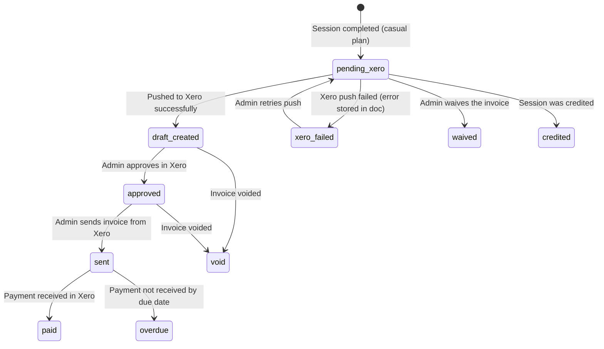

# 10 — Billing

## Overview

Studyroom has a two-layer billing system:
1. **Stripe** — handles student subscription access (monthly recurring payment for hub access)
2. **Xero** — handles invoicing for actual tutoring sessions (per-session or family invoices)

These two systems are intentionally separate: Stripe controls _who has access_ to the platform; Xero controls _how tutoring sessions are invoiced_.

---

## Core Billing Files

| File | Purpose |
|------|---------|
| `src/lib/studyroom/billing.ts` | Constants, plan types, billing outcome logic |
| `src/lib/studyroom/serverBilling.ts` | Atomic session action (Firestore transaction) |
| `src/lib/studyroom/invoiceEngine.ts` | Family invoice generation logic |
| `src/lib/studyroom/siblingPricing.ts` | Sibling session rate calculation |

---

## Plan Types

| Plan | Code | Sessions Included | Billing Method |
|------|------|------------------|----------------|
| Casual | `"casual"` | None (pay-per-session) | Invoiced per session via Xero |
| Package 5 | `"package_5"` | 5 base + 0 bonus | Prepaid entitlement consumed per session |
| Package 12 | `"package_12"` | 10 base + 2 bonus | Prepaid entitlement consumed per session |

---

## Session Rates

### Standard Rates (cents)

| Mode | Rate |
|------|------|
| In-home | $75.00 (7500¢) |
| Online | $60.00 (6000¢) |
| Group | $45.00 (4500¢) |

### Sibling Rates (Family Invoices)

When multiple students in the same family have casual sessions on the same day, sibling pricing applies:

| Rate Type | Rate | Condition |
|-----------|------|-----------|
| `standard` | $75.00 | Single student, or first in-home session |
| `backToBack` | $60.00 | Consecutive sessions, gap ≤ 15 minutes |
| `sameTime` | $40.00 | Overlapping session times |

Sibling pricing is calculated in `src/lib/studyroom/siblingPricing.ts` and applied during family invoice generation (`invoiceEngine.ts`).

---

## Billing Constants

Defined in `src/lib/studyroom/billing.ts`:

| Constant | Value | Description |
|----------|-------|-------------|
| `SESSION_DURATION_MINS` | 60 | Default session duration |
| `CASUAL_INVOICE_DUE_DAYS` | 3 | Days until casual invoice is due |
| `WITHDRAWAL_NOTICE_DAYS` | 14 | Notice required to withdraw from package |
| `LATE_CANCELLATION_HOURS` | 24 | Hours required for free cancellation |
| `LATE_FEE_CENTS` | 500 | Late cancellation fee ($5.00) |
| `LATE_FEE_GRACE_DAYS` | 7 | Days after late cancel before late fee applies |

---

## Billing Outcome Logic

When a session is completed or cancelled (`POST /api/sessions/status`), the function `computeBillingOutcome()` in `billing.ts` determines one of four outcomes:

```
cancelled_by_tutor
  → "credit" (no charge; tutor absorbs the session)

completed
  → "consume_entitlement" (if prepaid plan: package_5 or package_12)
  → "invoice"             (if casual plan)

cancelled_by_parent
  → notice >= 24 hours OR graceApplied == true
      → "no_charge"
  → notice < 24 hours AND no grace
      → "consume_entitlement" (prepaid) OR "invoice" (casual)

no_show
  → graceApplied == true
      → "no_charge"
  → graceApplied == false
      → "consume_entitlement" (prepaid) OR "invoice" (casual)

Any other status
  → "no_charge"
```

---

## Session Action Transaction (`applySessionAction`)

**File:** `src/lib/studyroom/serverBilling.ts`

This is the core billing operation. It runs as an atomic Firestore transaction to ensure consistency.

**What it does:**
1. Reads the session, plan, entitlement, student, and client documents
2. Calls `computeBillingOutcome()` to determine what happens
3. Based on outcome:
   - **consume_entitlement**: decrements `entitlements/{id}.baseConsumed` (or `bonusConsumed` if base pool exhausted)
   - **invoice**: creates an `invoices/{id}` document with `status: "pending_xero"`
   - **credit**: marks session as credited; no invoice
   - **no_charge**: marks session as not billed; no invoice
4. Updates `sessions/{id}` with final `status`, `billingOutcome`, `billingStatus`
5. Fires `POST /api/billing/push-invoice-to-xero` (fire-and-forget) for casual invoices

**Why it's atomic:** Session completion, entitlement consumption, and invoice creation must all succeed or all fail. A partial write would leave billing in an inconsistent state.

---

## Invoice Lifecycle



---

## Family Invoice Generation

**File:** `src/lib/studyroom/invoiceEngine.ts`  
**Function:** `generateFamilyInvoice()`

**When triggered:**
1. **Primary:** After a casual session is completed (in `applySessionAction()` — fire-and-forget)
2. **Fallback:** EOD cron job (`POST /api/sessions/eod-invoice`)

**Scope:** Groups all casual sessions for one family on a single calendar date (Brisbane timezone) into a single invoice.

**Line items:** One line item per session, with description, student name, date, time range, and rate type.

**Skips:** Package sessions (prepaid) — only casual sessions are invoiced this way.

**Result:** Creates a single `invoices/{id}` document with:
- `sessionIds: [...]` (all sessions for the family on that day)
- `rateSummary: [...]` (breakdown per session with rate type and amount)
- `dateKey: "YYYY-MM-DD"` (for deduplication)

---

## Stripe — Subscription Billing

Stripe handles the student's monthly subscription for hub access (not individual session billing).

**Price ID:** Monthly subscription (stored in env var `STRIPE_MONTHLY_PRICE_ID`)

**Flow:**
```
1. Student visits /subscribe
2. POST /api/stripe/create-checkout → Stripe Checkout URL
3. Student completes payment on Stripe-hosted checkout page
4. Stripe sends checkout.session.completed webhook
5. POST /api/stripe/webhook:
   - Sets users/{uid}.subscriptionStatus = "active"
   - Stores stripeCustomerId and stripeSubscriptionId
   - Sets role: "student" (preserves "parent" role if already set)
6. Student is redirected to /onboarding
```

**Webhook events handled:**
- `checkout.session.completed` → active
- `customer.subscription.deleted` → cancelled
- `customer.subscription.paused` → cancelled
- `invoice.payment_failed` → past_due

**Customer Portal:** Students/parents can manage their Stripe subscription (cancel, update payment method) via `POST /api/stripe/customer-portal`, which returns a Stripe-hosted portal URL.

---

## Xero — Session Invoicing

Xero handles the creation, approval, and sending of actual invoices for tutoring sessions.

**Invoice flow in Xero:**
```
Firestore invoice (pending_xero)
  → POST /api/billing/push-invoice-to-xero
  → Xero contact resolved or created (by parentEmail)
  → DRAFT invoice created in Xero
  → Firestore invoice updated (draft_created, xeroInvoiceId)
  → Admin logs into Xero and approves invoice
  → Admin sends invoice to parent via Xero
  → Parent pays
  → Xero marks invoice as paid
```

Studyroom does not automatically approve or send Xero invoices. The admin reviews and approves each DRAFT invoice manually.

**Xero contact matching:** The `push-invoice-to-xero` route searches for a Xero contact by `parentEmail`. If found, it uses the existing contact; if not, it creates a new one. This ensures all invoices for the same family are linked to the same Xero contact.

**Error handling:** If Xero push fails, the full error (message, status, response data) is stored on the `invoices/{id}` document (`status: "xero_failed"`, `xeroError`, `xeroDebug`). The invoice can be retried by calling the route again.

---

## Promo Codes & Trials

### How It Works

Promo codes grant trial access to the student hub without a Stripe subscription.

**Code types:**
- `free_trial` — Trial for a configurable number of days (default 7)
- `full_access` — Long-term access (~10 years, for beta participants)

**Eligibility:** By default (`eligibility: "new_users_only"`), a user can only redeem a code if they don't already have an active subscription or trial.

### Redemption Atomicity

Promo code redemption uses a Firestore transaction to prevent race conditions:
1. Re-reads the promo code inside the transaction
2. Checks capacity (`redemptionCount < maxRedemptions`)
3. Atomically increments `redemptionCount`
4. Adds uid to `redeemedBy` array
5. Sets `subscriptionStatus: "trial"` and `trialEndsAt` on the user document

### Trial Expiry

When a trial expires:
- `subscriptionStatus` reverts (via cron or next auth check)
- Student loses access to `/hub` and is redirected to `/subscribe`
- Warning email is sent by `POST /api/cron/trial-warnings` (requires external scheduler)

---

## Entitlement Consumption (Prepaid Packages)

For package_5 and package_12 students, session completion consumes entitlement credits rather than generating an invoice.

**Entitlement document structure:**
```
entitlements/{id}:
  baseSessions: 10    (e.g. package_12 gets 10 base)
  bonusSessions: 2    (e.g. package_12 gets 2 bonus)
  baseConsumed: 3     (sessions used from base pool)
  bonusConsumed: 0    (sessions used from bonus pool)
```

**Consumption order:** Base sessions are consumed first. When `baseConsumed >= baseSessions`, bonus sessions are consumed. Session document records `consumedFrom: "base"` or `"bonus"`.

---

## Package Alerts

The admin dashboard (`/hub/admin/packages`) shows a list of students with fewer than 4 sessions remaining in their prepaid package. This is a prompt for the admin to contact the family about renewal.

The package alert calculation reads from `packages/{packageId}` documents (checking `sessionsRemaining` field).
