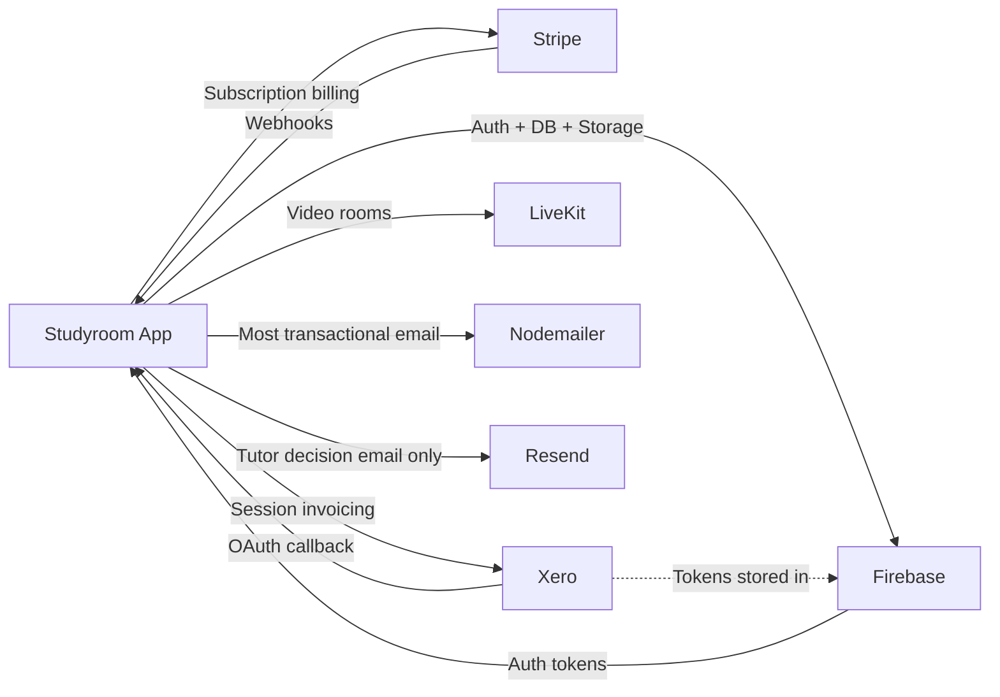

# 11 — Integrations

## Overview

Studyroom integrates with five external services. This document explains each integration's purpose, how it connects to the application, and what data flows through it.

> **Security note:** This document describes how integrations work without including any actual API keys, secrets, tokens, or credentials. All secrets must be stored in environment variables only — never in code or documentation.

---

## 1. Firebase (Auth + Firestore + Storage)

**Package:** `firebase` (client) + `firebase-admin` (server)  
**Firebase project:** `studyroom-6ba75`

### Firebase Authentication

**Purpose:** Manages user identity — signup, login, session persistence, and token issuance.

**How it connects:**
- Client-side: `src/lib/firebase.ts` initialises the Firebase client SDK. Exports `auth`, `db`, `storage`.
- Server-side: `src/lib/firebaseAdmin.ts` initialises the Firebase Admin SDK using a service account.

**Key flows:**
- Users sign in via `signInWithEmailAndPassword()` (client SDK)
- API routes verify identity via `verifyIdTokenFromRequest()` — decodes the Firebase ID token from the `Authorization: Bearer` header
- Studyroom creates Firebase users server-side (Admin SDK) during family signup and tutor onboarding

**Environment variables required:**
- `NEXT_PUBLIC_FIREBASE_API_KEY`
- `NEXT_PUBLIC_FIREBASE_AUTH_DOMAIN`
- `NEXT_PUBLIC_FIREBASE_PROJECT_ID`
- `NEXT_PUBLIC_FIREBASE_STORAGE_BUCKET`
- `NEXT_PUBLIC_FIREBASE_MESSAGING_SENDER_ID`
- `NEXT_PUBLIC_FIREBASE_APP_ID`
- `FIREBASE_PROJECT_ID`
- `FIREBASE_CLIENT_EMAIL`
- `FIREBASE_PRIVATE_KEY`

### Firestore

**Purpose:** Primary database. All application data (users, students, sessions, invoices, plans, etc.) is stored here.

**Connection:** The client SDK connects via `getFirestore(app)`. The Admin SDK connects via `getFirestore(adminApp)` on the server.

**Security:** Client-side access is governed by `firestore.rules`. Server-side Admin SDK bypasses all rules.

### Firebase Storage

**Purpose:** File storage for session work samples uploaded by tutors.

**Connection:** Client SDK via `getStorage(app)`. Upload logic is in `src/lib/storage.ts`.

**Note:** No custom Storage security rules file was found. See [15_Known_Technical_Debt.md](15_Known_Technical_Debt.md).

---

## 2. Stripe

**Package:** `stripe` (server) + `@stripe/stripe-js` (client)  
**Mode:** Live

### Purpose
Handles the student/family monthly subscription for hub access. Stripe does **not** handle per-session invoicing — that is Xero's responsibility.

### How It Connects

**Checkout flow:**
1. Client calls `POST /api/stripe/create-checkout` (passes Firebase ID token)
2. Server creates a Stripe Checkout Session with the monthly price ID
3. User is redirected to Stripe-hosted checkout page
4. On payment success, Stripe sends a webhook to `POST /api/stripe/webhook`
5. Webhook updates the user's Firestore document

**Customer portal:**
- `POST /api/stripe/customer-portal` returns a Stripe-hosted portal URL
- Parents/students use this to manage payment methods, view receipts, and cancel

**Webhook handling (`POST /api/stripe/webhook`):**
- Validates Stripe signature from `x-stripe-signature` header
- Handles: `checkout.session.completed`, `customer.subscription.deleted`, `customer.subscription.paused`, `invoice.payment_failed`

**Environment variables required:**
- `STRIPE_SECRET_KEY`
- `NEXT_PUBLIC_STRIPE_PUBLISHABLE_KEY`
- `STRIPE_WEBHOOK_SECRET`
- `STRIPE_MONTHLY_PRICE_ID`
- `NEXT_PUBLIC_APP_URL`

### Data Stored in Firestore

When a subscription is created:
- `users/{uid}.stripeCustomerId` — Stripe Customer ID
- `users/{uid}.stripeSubscriptionId` — Stripe Subscription ID
- `users/{uid}.subscriptionStatus` — `"active"`, `"cancelled"`, `"past_due"`
- `users/{uid}.subscribedAt` — Timestamp

---

## 3. Xero

**Package:** `xero-node`  
**Core module:** `src/lib/xero.ts`

### Purpose
Handles per-session invoicing. All tutoring session invoices are created as DRAFT invoices in Xero, then reviewed and sent by the admin.

### Authentication — OAuth2

Xero uses OAuth2 with refresh tokens. The token is stored in Firestore (`integrations/xero`) and managed by `src/lib/xero.ts`.

**Initial setup:**
1. Admin visits `/hub/admin/integrations/xero`
2. Admin calls `GET /api/xero/auth/start` — receives consent URL
3. Admin visits consent URL — Xero OAuth flow
4. Xero redirects to `GET /api/xero/auth/callback`
5. Callback exchanges auth code for tokens, fetches tenant ID, stores both in `integrations/xero`

**Token refresh:**
- `ensureXeroToken()` in `src/lib/xero.ts` manages token lifecycle
- 30-second in-memory cache to avoid unnecessary Firestore reads
- Auto-refreshes if `expires_at` is within 60 seconds
- Tries SDK refresh first, falls back to manual HTTP refresh if SDK fails
- Updated tokens are persisted to `integrations/xero` in Firestore

**OAuth Scopes:**
- `offline_access` — refresh token support
- `accounting.transactions` — read/write invoices
- `accounting.contacts` — read/write contacts
- `accounting.settings` — read org settings

**Environment variables required:**
- `XERO_CLIENT_ID`
- `XERO_CLIENT_SECRET`
- `XERO_REDIRECT_URI`
- `XERO_SALES_ACCOUNT_CODE` (default: `"200"`)

### Invoice Flow

```
Tutoring session completed
  → computeBillingOutcome() → "invoice"
  → invoiceEngine.generateFamilyInvoice() → invoices/{id} (status: pending_xero)
  → POST /api/billing/push-invoice-to-xero
    → Load invoice from Firestore
    → Resolve/create Xero contact by parentEmail
    → Create DRAFT invoice in Xero (ACCREC type)
    → Store xeroInvoiceId on Firestore invoice and session docs
  → Admin logs into Xero → approves invoice → sends to parent
  → Parent pays → invoice marked paid in Xero
```

**Invoice reference format:**
- Family invoice: `"Studyroom • FamilyName • YYYY-MM-DD"`
- Individual invoice: `"Studyroom • StudentName • Date"`

**Error handling:**
- Xero errors are caught and stored on the invoice document (`xeroError`, `xeroDebug`)
- The invoice can be retried without duplicate creation (deduplication by `xeroInvoiceId`)

### Data Stored in Firestore

- `integrations/xero.tenantId` — Xero organisation UUID
- `integrations/xero.tokenSet` — Full OAuth2 token set (access token, refresh token, expiry)
- `sessions/{id}.xeroInvoiceId` — Xero invoice UUID
- `invoices/{id}.xeroInvoiceId` — Xero invoice UUID
- `invoices/{id}.xeroInvoiceStatus` — Xero-side status

---

## 4. LiveKit

**Package:** `livekit-client` + `livekit-server-sdk` + `@livekit/components-react`  
**Cloud URL:** `wss://studyroom-[project].livekit.cloud` (exact URL in env vars)

### Purpose
Provides real-time video, audio, and screen sharing for the four study rooms (`/room/room-1` through `/room/room-4`).

### How It Connects

**Token issuance:**
1. Student enters a study room at `/room/[id]`
2. Client sends `POST /api/livekitToken` with Firebase ID token and room name
3. Server verifies Firebase token, creates LiveKit `AccessToken` with `{ role }` metadata
4. Returns `{ url, token }` to the client
5. Client connects to LiveKit cloud using the URL and JWT

**Capabilities granted per token:**
- `roomJoin: true`
- `canPublish: true` (video/audio)
- `canSubscribe: true`
- `canPublishData: true` (data channel for whiteboard sync)

**Study rooms:** 4 persistent rooms (room-1 to room-4). Room metadata (title, participant count, active status) is stored in Firestore `rooms/{roomId}`, not in LiveKit. LiveKit only manages the actual media session.

**Features used:**
- Video/audio tracks
- Screen sharing
- Data channel (used by whiteboard component for stroke broadcasting)
- Chat (separately implemented via Firestore `rooms/{roomId}/chat`, not LiveKit data channel)

**Environment variables required:**
- `LIVEKIT_URL`
- `LIVEKIT_API_KEY`
- `LIVEKIT_API_SECRET`

### Components

- `src/components/RoomControls.tsx` — Mic, camera, screen share, leave buttons
- `src/components/RoomPresenceBar.tsx` — Shows current participants
- `src/components/RoomWhiteboard.tsx` — Collaborative whiteboard (uses Firestore for stroke persistence)
- `src/components/ChatPanel.tsx` — In-room chat (uses Firestore, not LiveKit data channel)
- `src/components/SafeVideoArea.tsx` — Video rendering area
- `src/components/ConnectionChip.tsx` — Connection status indicator

---

## 5. Nodemailer (Gmail SMTP)

**Package:** `nodemailer`  
**Provider:** Gmail SMTP

### Purpose
Sends transactional emails from the platform:
- Session recap emails (to parents/students after a session)
- Tutor welcome emails (after admin approval)
- Trial expiry warning emails (automated)
- Contact form notification emails

### Configuration

| Setting | Value |
|---------|-------|
| Host | `smtp.gmail.com` |
| Port | `587` (STARTTLS) |
| User | `contact.studyroomaustralia@gmail.com` |

**Environment variables required:**
- `SMTP_HOST`
- `SMTP_PORT`
- `SMTP_USER`
- `SMTP_PASS` (Gmail App Password — not the account password)
- `MAIL_TO`

### Email Routes

| Route | Trigger | Recipients |
|-------|---------|-----------|
| `POST /api/email/session-recap` | Session completion (internal) | Parent/student |
| `POST /api/email/tutor-welcome` | Admin approves tutor | Tutor |
| `POST /api/cron/trial-warnings` | Cron job (nightly) | Users with expiring trials |
| `POST /api/contact` | Public contact form | Admin (MAIL_TO) |

### Error Handling

Email sending is treated as **non-fatal** in most flows. If an email fails to send, the underlying operation (onboarding submission, tutor approval) still succeeds. Failures are logged but do not block the primary workflow.

---

## 6. Resend (Transactional Email — Partial)

**Package:** None — direct `fetch` to Resend REST API (no SDK installed)  
**Used in:** `src/app/api/admin/tutor-access/decision/route.ts` only

### Purpose

Sends tutor approval and rejection notification emails when an admin makes a decision on a pending tutor access request.

### How it connects

A direct `fetch("https://api.resend.com/emails", ...)` call, authenticated via `RESEND_API_KEY` and `RESEND_FROM` environment variables. No Resend SDK is used.

**Environment variables required:**
- `RESEND_API_KEY`
- `RESEND_FROM`

### Inconsistency note

All other transactional emails in the platform use **Nodemailer (Gmail SMTP)** — see section 5 above. Only the tutor access decision email uses Resend. This inconsistency is undocumented and appears unintentional. See [15_Known_Technical_Debt.md](15_Known_Technical_Debt.md) for the recommended resolution.

---

## Integration Dependencies Map


